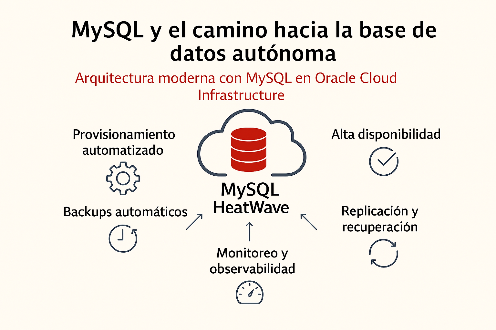
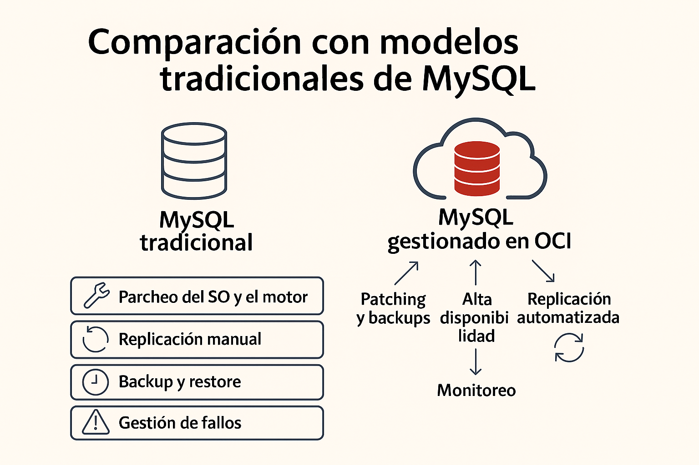
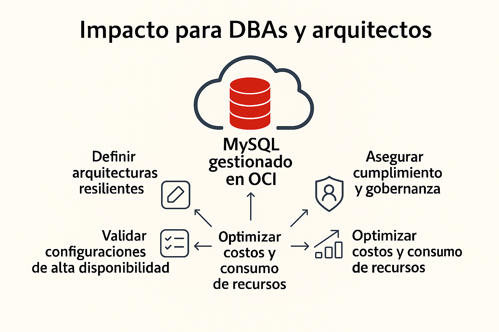

# MySQL y el camino hacia la base de datos autónoma
## Arquitectura moderna con MySQL en Oracle Cloud Infrastructure

Durante mucho tiempo, la idea de una base de datos autónoma estuvo asociada casi exclusivamente a motores enterprise tradicionales. Sin embargo, la evolución de los servicios gestionados en la nube ha llevado este concepto también al mundo open source, y **MySQL en Oracle Cloud Infrastructure (OCI)** es un claro ejemplo de ello.

Hoy, MySQL no es solo un motor de base de datos ampliamente adoptado, sino una **plataforma gestionada** que incorpora automatización, resiliencia y optimización por diseño, acercándose progresivamente a un modelo de autonomía operativa.

---

## ¿Qué significa “autonomía” en MySQL?

Cuando hablamos de autonomía en MySQL dentro de OCI, no nos referimos a un único componente, sino a un **conjunto de capacidades integradas** que reducen de forma significativa la carga operativa:

- Provisionamiento automatizado  
- Backups automáticos con retención configurable  
- Alta disponibilidad nativa  
- Replicación y recuperación ante fallos  
- Escalabilidad simplificada  
- Monitoreo y observabilidad integrados  

El resultado es un modelo donde el equipo **no administra la base de datos a bajo nivel**, sino que se enfoca en definir arquitectura, políticas y objetivos de disponibilidad.

---

## El rol de MySQL HeatWave en este modelo

MySQL HeatWave juega un papel clave en esta evolución. Además de ofrecer capacidades analíticas de alto rendimiento sin movimiento de datos, refuerza el enfoque de plataforma gestionada al integrarse nativamente con los servicios de OCI.

Desde una perspectiva arquitectónica, HeatWave permite:

- Ejecutar cargas **transaccionales y analíticas** sobre el mismo conjunto de datos  
- Eliminar arquitecturas complejas de ETL  
- Optimizar el rendimiento sin tuning manual intensivo  
- Consumir analítica avanzada como parte del servicio, y no como un stack adicional  

Esto posiciona a MySQL como una solución que va más allá del motor relacional tradicional.

---

## Arquitectura moderna con MySQL en OCI

Una arquitectura moderna con MySQL en OCI se apoya en varios principios fundamentales:

- **Alta disponibilidad por defecto**, mediante instancias altamente disponibles  
- **Automatización operacional**, reduciendo la intervención manual  
- **Seguridad integrada**, con cifrado, control de acceso e integración con OCI IAM  
- **Escalabilidad controlada**, alineada con las necesidades de la aplicación  
- **Observabilidad continua**, utilizando OCI Monitoring y Logging  

El foco deja de estar en “mantener la base funcionando” y pasa a **diseñar correctamente la arquitectura que la rodea**.

---

## Comparación con modelos tradicionales de MySQL

En entornos tradicionales, incluso cuando MySQL se ejecuta en la nube como IaaS, el equipo sigue siendo responsable de:

- Parcheo del sistema operativo y del motor  
- Configuración manual de replicación  
- Estrategias de backup y restore  
- Monitoreo y alertas personalizadas  
- Gestión de fallos y recuperación  

En el modelo gestionado y automatizado de OCI, gran parte de estas tareas se **trasladan a la plataforma**, reduciendo riesgos, errores humanos y costos operativos, y permitiendo un mayor foco en el valor del negocio.

---

## Impacto para DBAs y arquitectos

Lejos de eliminar el rol del DBA, este modelo lo **eleva**.

El profesional deja de ser un operador reactivo y pasa a desempeñar funciones más estratégicas, como:

- Definir arquitecturas resilientes  
- Validar configuraciones de alta disponibilidad  
- Asegurar cumplimiento y gobernanza  
- Acompañar el diseño de aplicaciones cloud‑native  
- Optimizar costos y consumo de recursos  

La autonomía no reemplaza la arquitectura; **exige una arquitectura mejor diseñada**.

---

## Conclusión

MySQL en Oracle Cloud Infrastructure demuestra que el concepto de base de datos autónoma **no depende exclusivamente del motor**, sino del diseño de la plataforma y del nivel de automatización que la rodea.

Con servicios gestionados, capacidades avanzadas como HeatWave y una integración profunda con OCI, MySQL se consolida como una opción sólida para arquitecturas modernas que buscan **menor complejidad operativa y mayor foco en los datos y en el valor para el negocio**.

La pregunta ya no es si MySQL puede operar de forma autónoma, sino:

**¿estamos diseñando arquitecturas que realmente aprovechen esa autonomía?**
``

---

## Autor

**Rafael Vida**  
Oracle ACE | DBA & Data Architect  
Oracle | MySQL |  AWS & OCI
